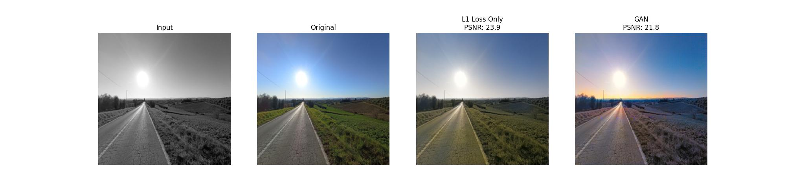

# 🎨 Image Colorization: U-Net vs. GAN

**Student:** Akzat Muratbekov
**Matricola:** 169704

# Deep Landscape Colorization using Conditional GANs 🎨

A PyTorch implementation of a Deep Learning pipeline for colorizing grayscale landscape images. This project uses a **Conditional Generative Adversarial Network (cGAN)**, featuring a custom **U-Net Generator** and a **PatchGAN Discriminator** to produce highly realistic, vibrant colorizations.

The model is specifically trained and optimized for **landscape photography** using a dataset from Kaggle.

## 📊 Output

  

*Notice how Phase 2 (GAN) produces more vibrant and realistic colors compared to the safer, sometimes desaturated guesses of the pure U-Net.*

## 🧠 Architecture & Approach

Unlike standard RGB colorization, this project operates in the **CIELAB (LAB) color space**:
1. **Input:** The `L` channel (Lightness / Grayscale).
2. **Prediction:** The model predicts the `a` and `b` channels (Color components).
3. **Output:** The predicted `ab` channels are concatenated with the original `L` channel and converted back to RGB.

### Network Components:
* **Generator (U-Net):** Built from scratch with manual encoder-decoder skip connections to prevent the loss of spatial resolution and high-frequency details.
* **Discriminator (PatchGAN):** Evaluates image patches (rather than the whole image) to penalize unrealistic color distributions and encourage sharp, localized colorization.

## 🚀 Training Strategy

The training process is divided into two distinct phases for optimal convergence:
1. **Phase 1 (Warm Start):** The U-Net generator is trained independently using **L1 Loss** (`train_unet.py`). L1 is preferred over MSE/L2 to prevent the "muddy" or desaturated grayish colors typical in averaging losses.
2. **Phase 2 (GAN Fine-tuning):** The pre-trained U-Net weights are loaded, and the model is fine-tuned against the PatchGAN Discriminator using **Binary Cross-Entropy (BCE) Adversarial Loss + L1 Loss** (`train_gan.py`).

## 📂 Code Organization

* **`run.py`**: Main execution script. Loads weights, processes test samples, and saves outputs.
* **`train_unet.py`**: Phase 1 training script (L1 Loss only).
* **`train_gan.py`**: Phase 2 training script (Adversarial + L1 Loss).
* **`models/unet.py`**: PyTorch implementation of the U-Net Generator.
* **`models/discriminator.py`**: PyTorch implementation of the PatchGAN Discriminator.
* **`data/dataset.py`**: Custom PyTorch Dataset handling `Image.BICUBIC` resizing, RGB-to-LAB conversion, and `[-1, 1]` tensor normalization.

